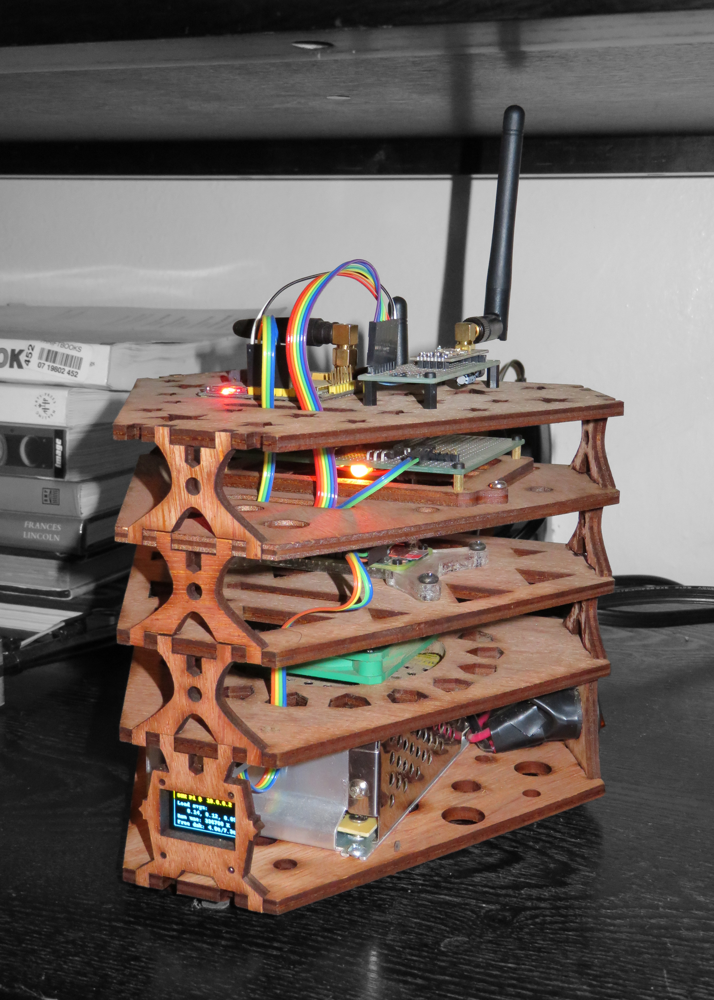
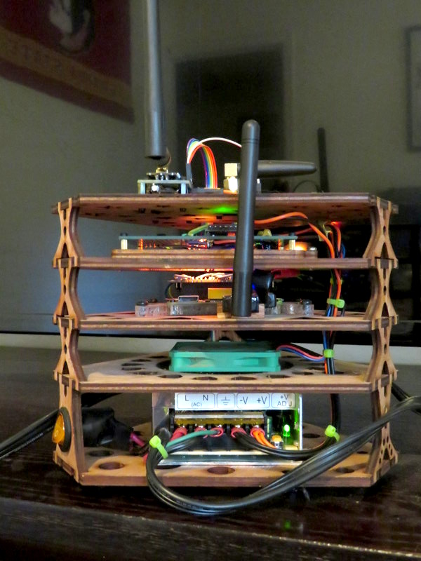

# Radio-Turret-Server
Laser cut pi server with arduino watchdog, oled display, and 3 radios: wifi, ISM, GSM. 

## A Server for Struma
I've been setting up linux servers for years but I've never really had much use for them beyond simple tasks. 

Since learning to program, more and more I have a need for a low power server that is always on and can run scripts and control perefs for me -preferably wirelessly.
In addition to webscraping, I would like to use the server as a security solution for when I am away from home.

I've made 3 prior version of this server based on the raspberry pi Zero and the overall product was always less than stellar with really low level wireless interfaces. 

Using the laser cutter at my univeristy I made a final version of the server that is more permanent and asthetically pleasing.

  
  
  

## Video

## Under the Hood
*  Raspberry Pi Zero  ++ Server
*  Arduino Pro Mini   +++ Watchdog
*  N-Wifi USB         +++++++ Wifi Radio
*  NRF24l01+          +++++++ ISM Radio
*  A6 GSM Modem       +++ Cellular Radio
*  Oled Display 
*  5 Volt Fan
*  25 Watt 5v PSU
